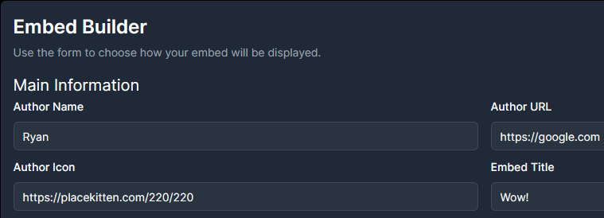
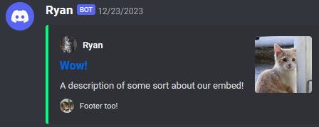

# React Discord Embed Components

## DiscordEmbedBuilder

Use a convenient form for building discord embeds that be input into [Discord.js](https://github.com/discordjs) or sent to a standard discord webhook.



### Props

| Name          | Type                                                                                         |
| ------------- | ---------------------------------------------------------------------------------------------|
| embedData     | [EmbedData](https://github.com/kennyLdev/discord-embed-components/blob/main/src/index.tsx#L1)|

## DiscordEmbedPreview

Preview a discord embed in the browser.




### Props

| Name          | Type                                                                                         |
| ------------- | ---------------------------------------------------------------------------------------------|
| embedData     | [EmbedData](https://github.com/kennyLdev/discord-embed-components/blob/main/src/index.tsx#L1)|
| setEmbedData  | [useState set function](https://react.dev/reference/react/useState#setstate)                 |

## Tips

### Initial State

You can create an empty object with the [EmbedData](https://github.com/kennyLdev/discord-embed-components/blob/main/src/index.tsx#L1) type to get your initial embedData prop.

```ts
const [embedData, setEmbedData] = useState<EmbedData>({});
```

## Example Project

View an example project [here](https://kennyldev.github.io/discord-embed-components/)!
